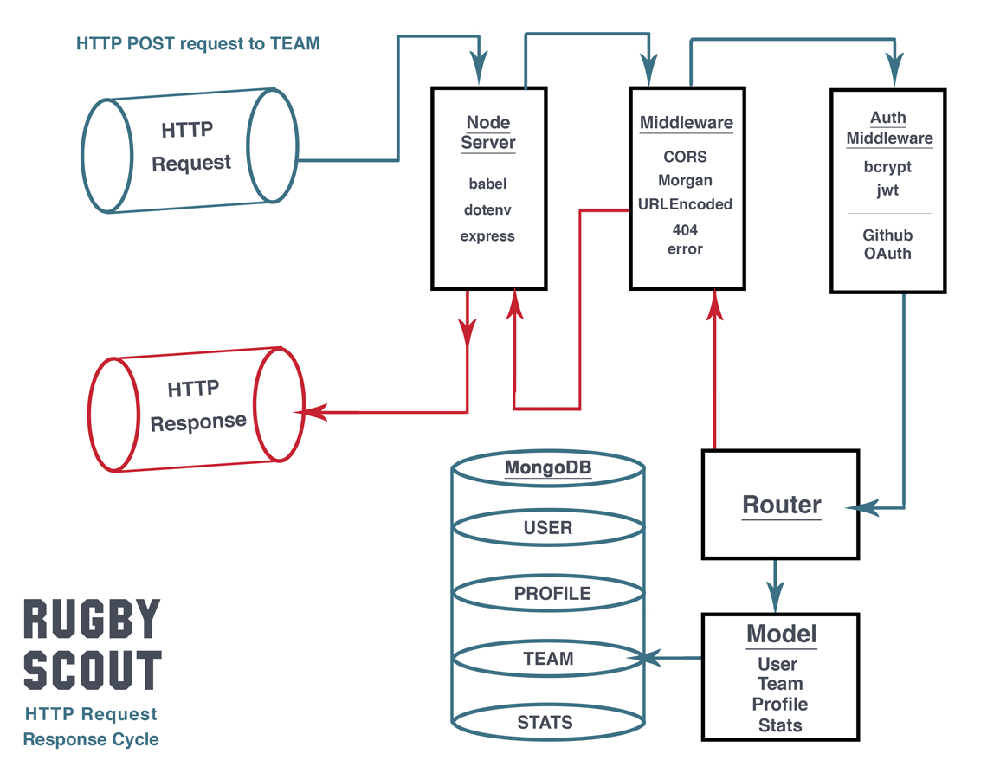

# Rugby Scout 
A web application that will track Rugby stats and players to make information accessible to college recruiters. Create an interface that will allow rugby, teams, coaches and players to upload a profile with stats, videos. 

# About Us
Created by: [Sharon Miller](https://github.com/SharonMiller), [Connor Crossley](https://github.com/Concross), [Alex Hanson](https://github.com/alexlhanson)


## Table of Contents
<!-- TOC -->
- [Installation](#installation)
- [Technologies Used](#technologies-used)
- [Entity Relationship Diagram](#entity-relationship-diagram)
- [Schemas](#schemas)
- [HTTP Request Response Cycle](#http-request-response-cycle)
- [Model Finder](#model-finder)
- [RESTful API's](#api)
- [Auth](#auth)
- [User Stories](#user-stories)


## Installation
1. [Clone Repository](https://github.com/TeamAquamarine/rugby-scout-server)
2. npm istall
3. change sample-env to .env and add your values

## Technologies Used
* **[Node.js](https://nodejs.org)**

  * Application dependencies:
    * [express](https://www.npmjs.com/package/express)
    * [bcrypt](https://www.npmjs.com/package/bcrypt)
    * [babel](https://www.npmjs.com/package/@babel/cli)
    * [assert](https://github.com/browserify/commonjs-assert)
    * [cors](https://www.npmjs.com/package/cors)
    * [dotenv](https://www.npmjs.com/package/dotenv)
    * [jsonwebtoken](https://www.npmjs.com/package/jsonwebtoken)
    * [require-dir](https://www.npmjs.com/package/http-errors)
    * [mongoose](https://www.npmjs.com/package/mongoose)
    * [morgan](https://www.npmjs.com/package/morgan)
  * Developer dependencies:
    * [eslint](https://www.npmjs.com/package/eslint)
    * [superagent](https://www.npmjs.com/package/superagent)
    * [jest](https://www.npmjs.com/package/jest)
    * [debug](https://www.npmjs.com/package/debug)
    
* **[MongoDB](https://www.mongodb.com)** 
* **[Mongoose](http://mongoosejs.com/)**
* **[Heroku](https://www.heroku.com/)**
* **[TravisCI](https://travis-ci.org/)**

[Return to top](#table-of-contents)

## Entity Relationship Diagram


[Return to top](#table-of-contents)

## Schemas
**User Schema** 
```
{
  username: { type: String, required: true },
  password: { type: String, required: true },
  coach: { type: Schema.Types.ObjectId, ref: 'coaches' },
  player: { type: Schema.Types.ObjectId, ref: 'players' },
  team: { type: Schema.Types.ObjectId, ref: 'teams' },
  stats: { type: Schema.Types.ObjectId, ref: 'stats' },
  role: { type: String, enum: ['coach', 'player'] },
} 
```
**Profile Schema** 
```
{
  user: { type: Schema.Types.ObjectId, ref: 'users' },
  firstName: { type: String, required: true },
  lastName: { type: String, required: true },
  bio: { type: String, default: `Hello!` },
  email: { type: String },
} 
```
**StatBlock Schema** 
```
{
  user: { type: Schema.Types.ObjectId, ref: 'users', required: true },
  wins: { type: Number, min: 0, default: 0 },
  losses: { type: Number, min: 0, default: 0 },
  tries: { type: Number, min: 0, default: 0 },
  conversions: { type: Number, min: 0, default: 0 },
  penaltyGoals: { type: Number, min: 0, default: 0 },
  dropGoals: { type: Number, min: 0, default: 0 },
  tackles: { type: Number, min: 0, default: 0 },
  offloads: { type: Number, min: 0, default: 0 },
  handlingErrors: { type: Number, min: 0, default: 0 },
  runMeters: { type: Number, min: 0, default: 0 },
  linebreaks: { type: Number, min: 0, default: 0 },
  penaltiesConceded: { type: Number, min: 0, default: 0 },
  yellowCards: { type: Number, min: 0, default: 0 },
  redCards: { type: Number, min: 0, default: 0 },
} 
```
**Team Schema** 
```
{
  coach: { type: Schema.Types.ObjectId, ref: 'users'},
  players: [{ type: Schema.Types.ObjectId, ref: 'users'}],
  name: { type: String, required: true },
  city: { type: String, required: true },
  state: { type: String, required: true},
  phone: { type: String },
  email: {type: String},
} 
```

[Return to top](#table-of-contents)

## HTTP Request Response Cycle


[Return to top](#table-of-contents)

## Model Finder
```
import requireAll from 'require-dir';

// Find all exported models in the model directory
// require-dir documentation: https://github.com/aseemk/requireDir#usage
const models = requireAll('../models/');

// Export middleware
export default (req, res, next) => {
  
  // Save reference to model parameter from api request 
  let model = req && req.params && req.params.model;

  // check if model exists in server and attach model constructor to request
  if (model && models[model] && models[model].default) {
    req.model = models[model].default;
    next();
  } else {
    throw new Error('modelFinder Error: Model Not Found');
  }
};
```
[Return to top](#table-of-contents)

## API
* **User Model**
  * _POST_  - **/register** - Saves a new user to user model with hashed password and returns authorization token.
  * _GET_ - **/signin** - Passes username and password into request, compares to database and returns an authorization token.
  * _GET_ - **/outh** - Passes through handshaking process with 3rd-party authorization using Github account, saves user to user model and returns an authorization token. 
  * _GET_ - **/user/:id** - Public-facing retrieval request to see an individual user's stats and or profile information, while excluding private parameters.
* **Team Model**
  * _POST_ - **/team** - Creates a new team with required `name`, `city` and `state`.  This route is restricted to coach role in user.
  * _PUT_ - **/team** - Updates the team information according to associated authorized user.  Available to coach role.
  * _PUT_ - **/team/roster/add/:id** - Updates the team information according to associated authorized user by adding a new player to the players array in team model.  Available to coach role.
  * _PUT_ - **/team/roster/remove/:id** - Updates the team information according to associated authorized user by removing a player to the players array in team model.  Available to coach role.
  * _GET_ - **/team/:id** - Public-facing retrieval of information on a specific team id.

* **Profile Model**
  * _POST_ - **/profile** - Creates a new profile with userId referencing authorized user and requires `firstName`, `lastName`, and `role`.
  * _PUT_ - **/Profile** - Updates the profile information according to associated authorized user.
  * _GET_ - **/profile/:id** - Public-facing retrieval of information on a specific profile id. 
* **StatBlock Model**
  * _POST_ - **/statBlock** - Creates a new statBlock with userId referencing authorized user.
  * _PUT_ - **/statBlock** - Updates the statBlock information according to associated authorize user.  Available to coach role.
  * _GET_ - **/statBlock/:id** - Public-facing retrieval of information on a specific statBlock id.

  [Return to top](#table-of-contents)

## Auth
* For authentication Rugby-Scout supports basic and OAuth authentication.
* For authorization Rugby-Scout supports bearer authorization using JSON Web Token library.
* Passwords are hashed before adding to database for local setup.
* API calls use authorized user for permission and role parameter in the user to further specify permission.

[Return to top](#table-of-contents)

# User Stories

## Users
- As a **college recruiter** I want to use rugby scout to get stats and media related to a player so I can identify talent.

- As a **rugby player and coach** I should be able to create a profile with a bio, and stats so that I can help myself get identified by scouts. POST to id.

- As a **rugby player or coach** I should have the ability to update my stats so that recruiters can see the my latest performance statistics. _(put request to id)_

- As a **public user** I want to be able to see stats of all players, coaches and teams for my own purposes.

- 30 - As a **public user** I want to be able to see stats of a specific player or coach for my own purposes.

## Developers
- As a **developer** I want to have thorough test suites

- As a **developer** I want to create an auth server so that I can properly protect access to certain routes/requests

- As a **developer** I want to create an auth user model so that I can work with auth

- As a **developer** I want my code to be clean and readable

- As a **developer** I want to create a player resource in order to represent an individual player

- As a **developer** I want to create a coach resource in order to represent an individual coach

- As a **developer** I want to create a many to one relationship between players to coach

- As a **developer** I want to make my application deployable so that it can be more readily accessed by other users.

- As a **developer** I want to have good documentation so that my process can be understood and others can more readily contribute to it.

[Return to top](#table-of-contents)
